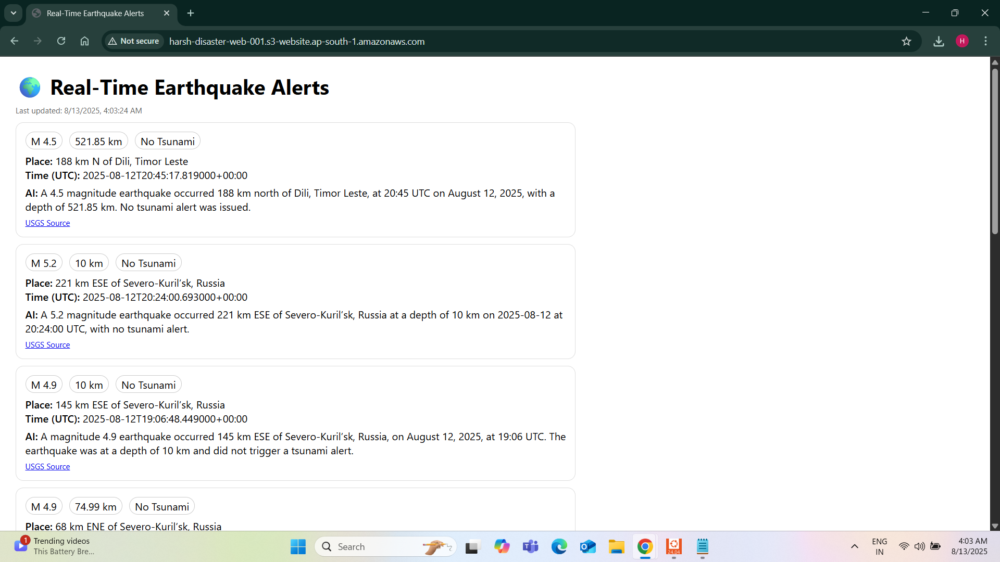
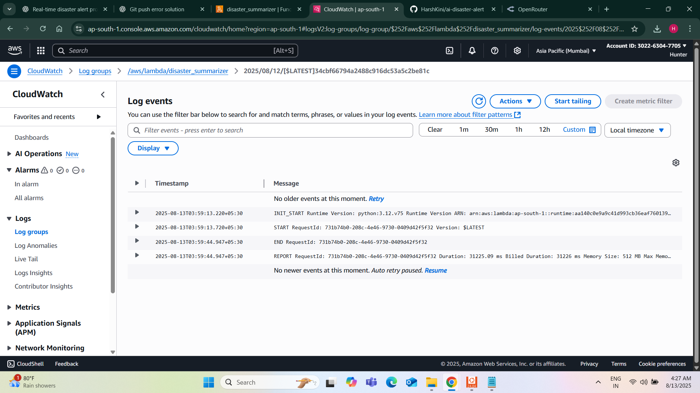
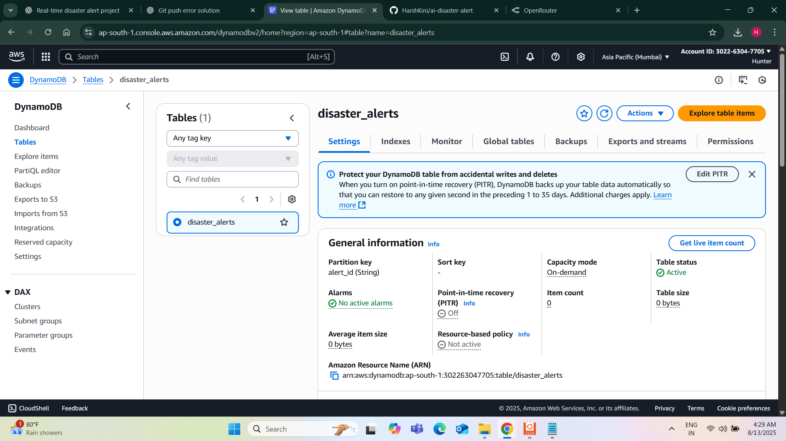

# 🌍 AI-Powered Real-Time Earthquake Alert System

An end-to-end **serverless disaster alert platform** using **AWS Cloud**, **Generative AI**, and **DevOps automation** — designed to fetch real-time earthquake data, summarize it with AI, and display it on a public website.

## 🚀 Features
- **Real-time earthquake alerts** from the USGS global feed
- **AI-generated summaries** (OpenRouter / HuggingFace)
- **Serverless architecture** (AWS Lambda, S3, DynamoDB)
- **Automated deployments** with Manual AWS Console Setup
- **Cost-efficient & scalable**

## 🛠 Tech Stack
- **AWS:** Lambda, S3, DynamoDB, EventBridge
- **AI:** OpenRouter + Qwen LLM / HuggingFace
- **IaC:** Manual AWS Console Setup
- **Frontend:** HTML, CSS, JavaScript
- **Backend:** Python 3.12

## 📂 Architecture
```plaintext
USGS Earthquake API → Lambda (Python) → AI Model → DynamoDB + S3 (alerts.json) → Static Website (S3 Hosting)
```

## 📸 Screenshots

### 1. **Live AI-Powered Earthquake Alert Dashboard**


### 2. **AWS Lambda Logs**


### 3. **DynamoDB Records**


*(Add your actual screenshots in the `screenshots/` folder — these images will display automatically on GitHub.)*

## 🧑‍💻 Setup Instructions
1. **Clone the repo**
   ```bash
   git clone https://github.com/HarshKini/ai-disaster-alert.git
   cd ai-disaster-alert
   ```
2. **Deploy infrastructure**  
   - Configure AWS CLI  
   - Update `manual AWS console setup.tfvars`  
   - Run:
     ```bash
     manual AWS console setup init
     manual AWS console setup apply
     ```

3. **Upload Lambda code**
   - Create zip:
     ```bash
     cd lambda
     zip -r ../lambda.zip handler.py
     ```
   - Upload via AWS Console.

4. **Test & view website**
   - Run Lambda test
   - Open the S3 bucket website URL

## 📅 Future Improvements
- SMS alerts for high-magnitude earthquakes
- Interactive map display
- Multi-disaster tracking (floods, cyclones, etc.)

## 📜 License
MIT License
